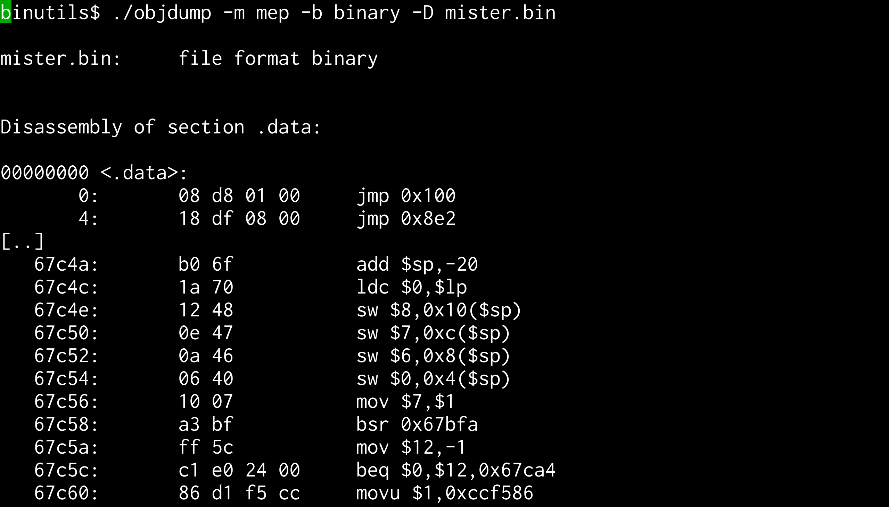
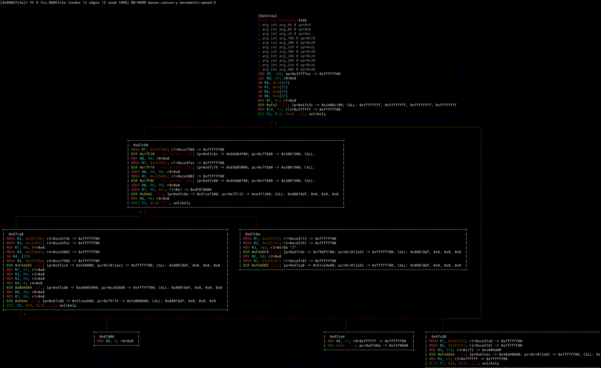

# r2m2
## radare2 + miasm2 = &#9829;

@guedou - 18/11/2016


---

# @guedou?

- French
- hobbyist reverser
- network security researcher
  - IPv6, DNS, TLS, BGP, DDoS mitigation, ...
- [Scapy](https://github.com/secdev/scapy) co-maintainer
  - Python-based packet manipulation program & library
- neither a [radare2](https://github.com/radare/radare2) nor [miasm2](https://github.com/cea-sec/miasm) power user

---

I needed to implement a rare CPU architecture **easily**

---

Back in December 2015, only `objdump` knew this architecture


---

# r2m2 goals?

r2m2 is a radare2 plugin that aims to:

- use [radare2](https://github.com/radare/radare2) as a frontend to miasm2
  - tools, GUI, shortcuts, ...

- use [miasm2](https://github.com/cea-sec/miasm) as a backend to radare2
  - asm/dis engine, symbolic execution, ...

- be architecture independent

---

### Adding a new architecture to miasm

---


## High-level checklist


1. registers in *miasm2/arch/ARCH/regs.py*

2. opcodes in *miasm2/arch/ARCH/arch.py*
3. semantic in *miasm2/arch/ARCH/sem.py*

---

## Adding a new opcode in arch.py

<br>

||MIPS ADDIU|
|--|--|
|Encoding|001001 ss ssst tttt iiii iiii iiii iiii|

<br>

The opcode is defined as:
```python
addop("addiu", [bs("001001"), rs, rt, s16imm], [rt, rs, s16imm]) 
```

--

The arguments are defined as:
```python
rs = bs(l=5, cls=(mips32_gpreg,))
rt = bs(l=5, cls=(mips32_gpreg,))
s16imm = bs(l=16, cls=(mips32_s16imm,))
```

<br>

*mips32_** objects implement `encode()` and `decode()` methods that return miasm expressions!

---

## Adding a new opcode in sem.py

<br>
Solution#1 - Implement the logic with miasm expressions
```python
def addiu(ir, instr, reg_dst, reg_src, imm16):

    expr_src = ExprOp("+", reg_src, imm16.zeroExtend(32))

    return [ExprAff(reg_dst, expr_src)], []
```

--

Solution#2 - Be lazy, and implement using the *sembuilder*
```python
@sbuild.parse
def addiu(reg_dst, reg_src, imm16):
    reg_dst = reg_src + imm16
```

--

The resulting expression is:
```python
>>> ir.get_ir(instr)  # instr being the IR of "ADDIU A0, A1, 2"
([ExprAff(ExprId('A0', 32), ExprOp('+', ExprId('A1', 32),
                            ExprInt(uint32(0x2L))))], [])
```


---

# r2m2
(at last!)

---

# What is r2m2?

- keeps most of the smart logics in miasm2
  - r2m2 aims to be architecture independent
  - uses the R2M2_ARCH env variable to specify the arch
- provides two r2 plugins:
  - ad: <u>a</u>ssembly & <u>d</u>isassembly
  - Ae: <u>A</u>nalysis & <u>e</u>sil

<br>
```bash
r2m2$ rasm2 -L |grep r2m2
adAe  32         r2m2        LGPL3   miasm2 backend
```

---

# r2m2_ad - the easy plugin

- simple CFFI / C wrapper around a miasm2 `Machine()`
- provides miasm2 assembly & disassembly features to radare2

<br>
MIPS32 assembly/disassembly with rasm2:
```bash
r2m2$ export R2M2_ARCH=mips32l; rasm2 -a r2m2 'addiu a0, a1, 2' |rasm2 -a r2m2 -d -
ADDIU      A0, A1, 0x2
```

--

miasm2 MSP430 in r2 with random instructions:
```bash
r2m2$ R2M2_ARCH=msp430 r2 -a r2m2 -qc 'woR; pd 5' -
            0x00000000      07fa           and.w      R10, R7
            0x00000002      47ad           dadd.b     R13, R7
            0x00000004      f05e0778       add.b      @R14+, 0x7807(PC)
            0x00000008      f46d81ed       addc.b     @R13+, 0xED81(R4)
            0x0000000c      3fdc           bis.w      @R12+, R15
```

--

miasm2 x86-64 on `/bin/ls`:
```bash
r2m2$ R2M2_ARCH=x86_64 r2 -a r2m2 /bin/ls -qc 'pd 7 @0x00404a1c'
            0x00404a1c      4883f80e       CMP        RAX, 0xE
            0x00404a20      4889e5         MOV        RBP, RSP
            0x00404a23      761b           JBE        0x1D
            0x00404a25      b800000000     MOV        EAX, 0x0
            0x00404a2a      4885c0         TEST       RAX, RAX
            0x00404a2d      7411           JZ         0x13
            0x00404a2f      5d             POP        RBP
```

<br>
Where does these jumps go?

---

## r2m2_Ae - the challenging one

Use miasm2 to __automatically__
- find branches
- find function calls
- split blocks
- emulate instructions
- ...

--

# How?

Step#1 - use miasm2 expressions and internal methods
  - `breakflow()`, `dstflow()`, `is_subcall()`

```python
# r2m2 incomplete example
if instr.is_subcall():
    if isinstance(instr.arg, ExprInt):
        analop.type = R_ANAL_OP_TYPE_CALL
        analop.jump = address + int(instr.arg)
    else:
        analop.type = R_ANAL_OP_TYPE_UCALL
```

--

A simple MIPS32 output

```bash
r2m2$ R2M2_ARCH=mips32b rasm2 -a r2m2 'j 0x4; nop' -B > j_nop.bin

r2m2$ R2M2_ARCH=mips32b r2 -a r2m2 j_nop.bin -qc 'pd 2'
        ,=< 0x00000000      08000001       J          0x4
        `-> 0x00000004      00000000       NOP 
```

--

A more complex output - r2 vs r2m2

```bash
r2$ r2 /bin/ls -qc 'pd 12 @0x00404a1c'
            0x00404a1c      4883f80e       cmp rax, 0xe
            0x00404a20      4889e5         mov rbp, rsp
        ,=< 0x00404a23      761b           jbe 0x404a40
        |   0x00404a25      b800000000     mov eax, 0
        |   0x00404a2a      4885c0         test rax, rax
       ,==< 0x00404a2d      7411           je 0x404a40
       ||   0x00404a2f      5d             pop rbp
       ||   0x00404a30      bf60e66100     mov edi, loc._edata         ; loc._edata
       ||   0x00404a35      ffe0           jmp rax
       ||   0x00404a37      660f1f840000.  nop word [rax + rax]
       ``-> 0x00404a40      5d             pop rbp
            0x00404a41      c3             ret
```
```bash
r2m2$ R2M2_ARCH=x86_64 r2 -a r2m2 /bin/ls -qc 'pd 12 @0x00404a1c'
            0x00404a1c      4883f80e       CMP        RAX, 0xE
            0x00404a20      4889e5         MOV        RBP, RSP
        ,=< 0x00404a23      761b           JBE        0x1D
        |   0x00404a25      b800000000     MOV        EAX, 0x0
        |   0x00404a2a      4885c0         TEST       RAX, RAX
       ,==< 0x00404a2d      7411           JZ         0x13
       ||   0x00404a2f      5d             POP        RBP
       ||   0x00404a30      bf60e66100     MOV        EDI, loc._edata
       ||   0x00404a35      ffe0           JMP        RAX
       ||   0x00404a37      660f1f840000.  NOP        WORD PTR [RAX*0x2]
       ``-> 0x00404a40      5d             POP        RBP
            0x00404a41      c3             RET       
```

--

Step#2 - convert miasm2 expression to radare2 ESIL

- both achieve the same goal: express instructions semantics

- simple automatic conversions are possible
```
m2 expr -> ExprAff(ExprId("R0", 32), ExprInt(0x2807, 32))
r2 esil -> 0x2807,r0,=
```

- need to dynamically define the radare2 registers profile

- some instructions are problematic, as their semantics are complex

--

A simple MIPS32 output

```bash
r2m2$ R2M2_ARCH=mips32b rasm2 -a r2m2 'j 0x4; nop' -B > j_nop.bin

r2m2$ R2M2_ARCH=mips32b r2 -a r2m2 j_nop.bin -qc 'e asm.emu=true; pd 2'
        ,=< 0x00000000      08000001       J          0x4             ; pc=0x4 
        `-> 0x00000004      00000000       NOP    n
```

--

A more complex output

```bash
R2M2_ARCH=x86_64 r2 -a r2m2 /bin/ls -qc 'e asm.emu=true; pd 12 @0x00404a1c'
            0x00404a1c      4883f80e       CMP        RAX, 0xE        ; zf=0x0 
            0x00404a20      4889e5         MOV        RBP, RSP        ; rbp=0x0 
        ,=< 0x00404a23      761b           JBE        0x1D            ; unlikely
        |   0x00404a25      b800000000     MOV        EAX, 0x0        ; eax=0x0 
        |   0x00404a2a      4885c0         TEST       RAX, RAX        ; zf=0x1 -> 0x2464c00
       ,==< 0x00404a2d      7411           JZ         0x13            ; unlikely
       ||   0x00404a2f      5d             POP        RBP             ; rsp=0x8 ; rbp=0x0 
       ||   0x00404a30      bf60e66100     MOV        EDI, loc._edata ; edi=0x61e660 -> 0x68732e00 loc._edata
       ||   0x00404a35      ffe0           JMP        RAX             ; rip=0x0 
       ||   0x00404a37      660f1f840000.  NOP        WORD PTR [RAX*0x2]
       ``-> 0x00404a40      5d             POP        RBP             ; rsp=0x10 -> 0x3e0000; rbp=0x3e0002 -> 0xffffff00
            0x00404a41      c3             RET                        ; rsp=0x18 -> 0x404900
```

---

# Concluding remarks

- miasm2 and radare2 are powerful tools
  - combining them turned out to be efficient

- r2m2 is more than *"PoC that works on my laptop"*
```bash
$ docker run --rm -it -e 'R2M2_ARCH=mips32l' guedou/r2m2 \
  "rasm2 -a r2m2 'addiu a0, a1, 2'"
```

- too good to be true?
  - could be, yet r2m2 is better than nothing

---

Today, allows me to get call graphs


---

Questions?
Comments?
Issues?
Beers?

https://github.com/guedou/r2m2
