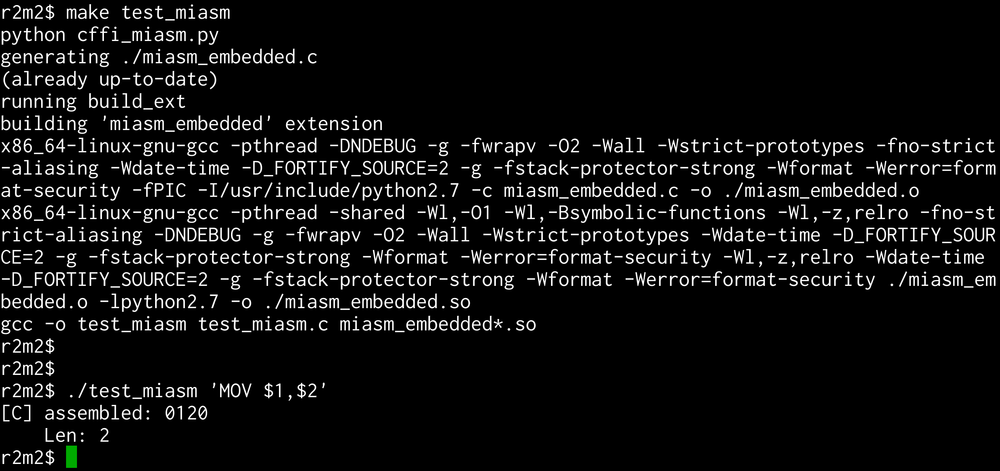
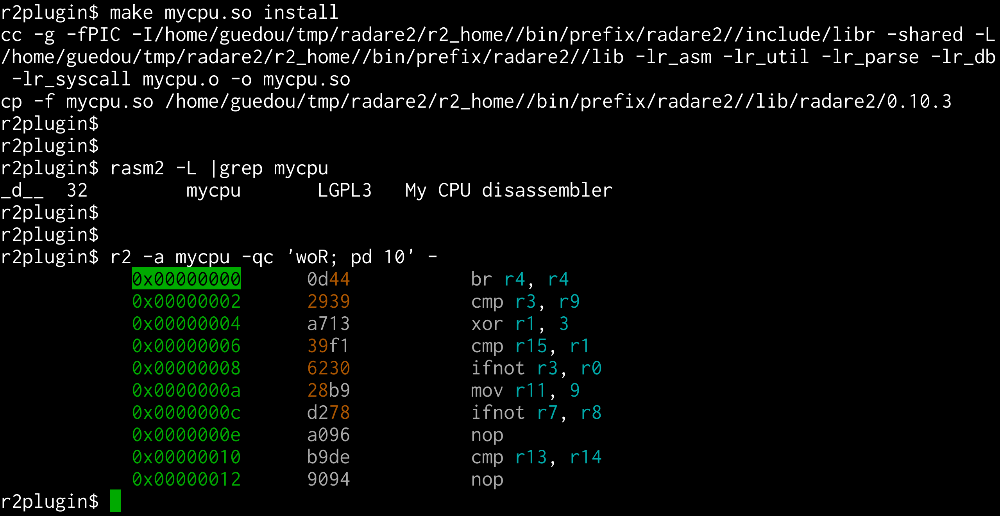
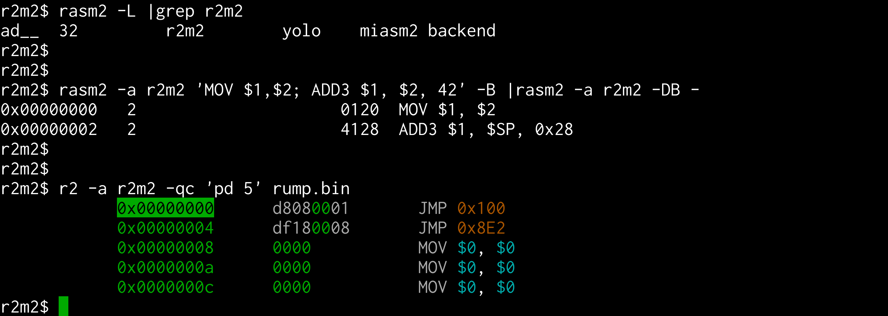
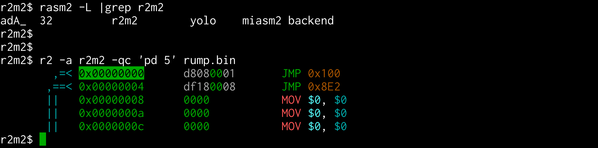
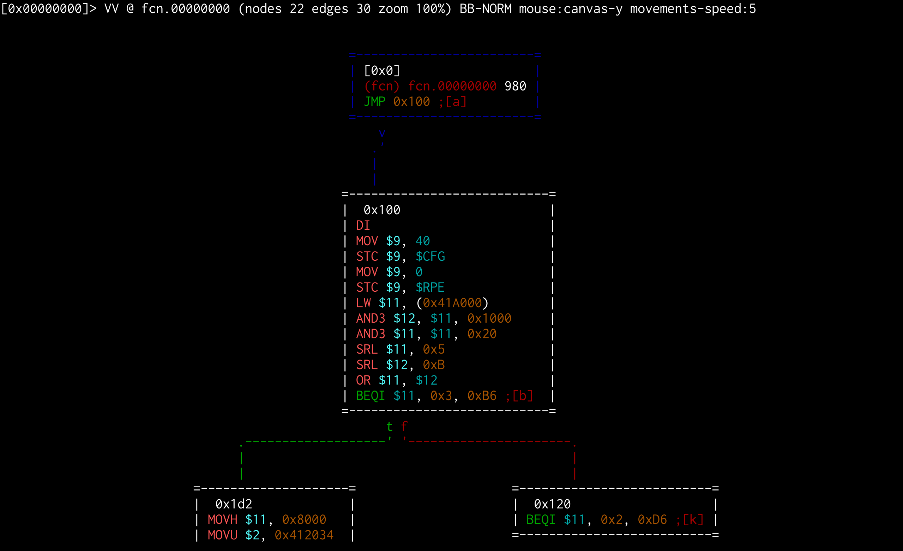
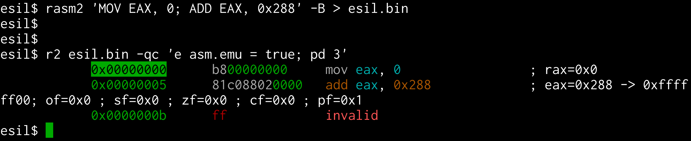
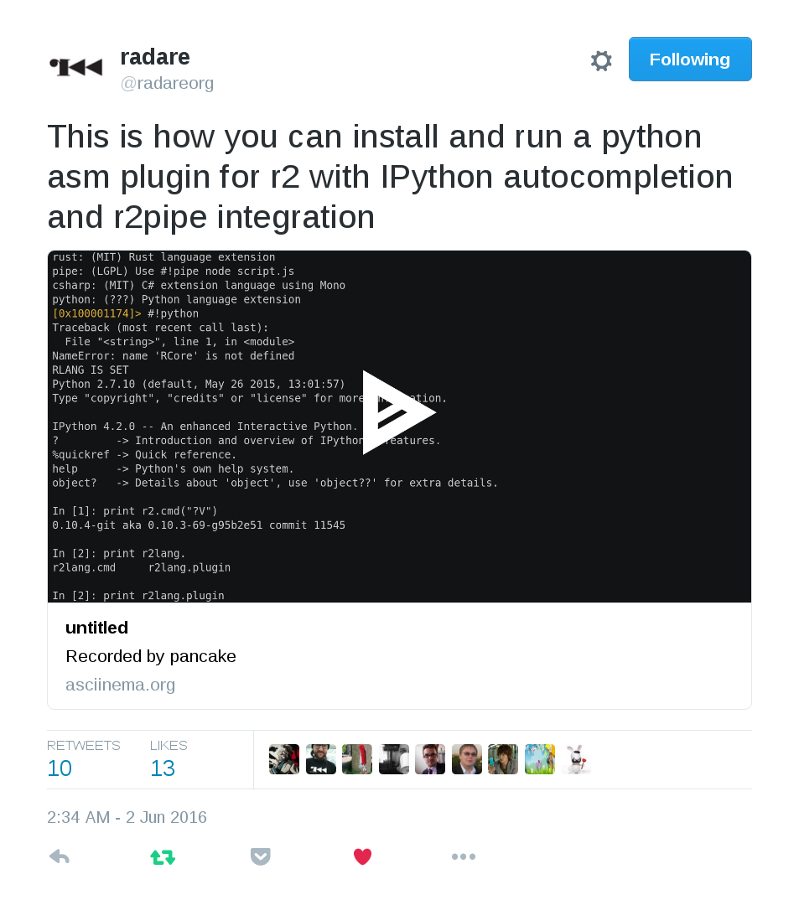
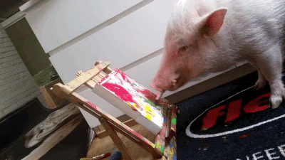

# r2m2
## radare2 + miasm2 = love &#9829;

SSTIC2016 - @guedou

# Goals?

r2m2 is a radare2 plugin that aims to:

- use [radare2](https://github.com/radare/radare2) as a frontend to miasm2
  - tools, GUI, shortcuts, ...

- use [miasm2](https://github.com/radare/radare2) as a backend to radare2
  - asm/disas engine, symbolic execution, ...

# mer il es fou ?!?

## Step #1 - Call Python from C

The [cffi](https://cffi.readthedocs.io/en/latest/overview.html#embedding) Python module produces a `.so`

## Step #2 - Build a radare2 plugin

The r2 Wiki shows how to add a [new architecture](https://github.com/radare/radare2/wiki/Implementing-a-new-architecture)

## Step #3 - Shake well

`assemble()` & `disassemble()` must be implemented

## Step #4 - call graph

Use miasm2 to *classify* opcodes according to radare2 types

# Next steps?

1/ Convert m2 expressions to r2 esil

2/ Use the radare2 plugin API

See [video](https://asciinema.org/a/16ko4jd1e6kdrqkqjxeu248hm) &
[code](https://github.com/radare/radare2-bindings/blob/41d17b7e7ea4878790907f20a19392a274d204c7/libr/lang/p/test-py-asm.py)

# Code?

