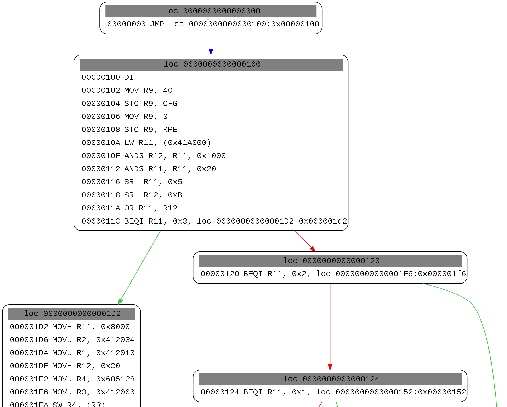

## r2m2 &#10097; radare2 + miasm2 = &#9829;
https://github.com/guedou/r2m2


@guedou - 28/01/2017 - REcon BRX

---

## @guedou?

- French
- hobbyist reverser
- network security researcher
  - IPv6, DNS, TLS, BGP, DDoS mitigation, ...
- [Scapy](https://github.com/secdev/scapy) co-maintainer
  - Python-based packet manipulation program
- neither a [radare2](https://github.com/radare/radare2) nor [miasm2](https://github.com/cea-sec/miasm) power user

---


# What is r2m2?

---

## Goals

r2m2 is a radare2 plugin that aims to:

- ease reversing a new architecture

- use [miasm2](https://github.com/cea-sec/miasm) as a backend to radare2
  - asm/dis engine, symbolic execution, ...

- use [radare2](https://github.com/radare/radare2) as a frontend to miasm2
  - tools, GUI, shortcuts, ...

- be architecture independent
  - x86/ARM/MIPS/... logic

---

## Benefits

-  implement faster
  - miasm2 is highly expressive
  - modify the implementation on the fly

- flexibility
  - not stuck with a single usage
  - get both miasm2 and radare2 features
    - asm/dis/emulation/... & GUI/tools/ ...

- use dynamic analysis to enhance static analysis
  - r2m2 convert miasm2 IR into radare2 ESIL
    - JUMP addresses, accessed strings, ...

---

r2m2 works on Linux, OS X and <u>Docker</u>

https://github.com/guedou/r2m2

---

# Why ?

---

In 2015, I *discovered* a rare CPU architecture

---

The firmware update binary was useless

---

<!-- .slide: data-background="images/spi.jpg" -->
<p style="margin-right: -300px;">
<font color=black>Desolder & dump the SPI flash \\(^^)/</font>
</p>

---

A friend found the following format string:

<font size="6px">PSW:%08x LP:%08x NPC:%08x EXC:%08x EPC:%08x\n</font>

---

<!-- .slide: data-background="images/google_mep.png" -->
<p style="margin-right: -300px;">
<font color=black>This rare CPU architecture is called Toshiba MeP !</font>
</p>

---

Only `objdump` knew this architecture

```
binutils$ objdump -m mep -b binary -D mister.bin
mister.bin:     file format binary


Disassembly of section .data:

00000000 <.data>:
       0:       08 d8 01 00     jmp 0x100
       4:       18 df 08 00     jmp 0x8e2
[..]
   67c4a:       b0 6f           add $sp,-20
   67c4c:       1a 70           ldc $0,$lp
   67c4e:       12 48           sw $8,0x10($sp)
   67c50:       0e 47           sw $7,0xc($sp)
   67c52:       0a 46           sw $6,0x8($sp)
   67c54:       06 40           sw $0,0x4($sp)
```

---

I decided to implement it in miasm2

---

# Demo #1

---

Get slides & examples at

https://guedou.github.io/

---

# miasm 101

---

<!-- .slide: style="text-align: left;"> -->  
## What is miasm?

Python-based reverse engineering framework with many awesome features:

- assembly / disassembly x86 / ARM / MIPS / SH4 / MSP430
- instructions semantic using intermediate language
- emulation using JIT
- ease implementing a new architecture
- ...

See http://miasm.re & https://github.com/cea-sec/miasm
for code, examples and demos

---

## Assembling

```python
# Create a x86 miasm machine
>>> from miasm2.analysis.machine import Machine
>>> m = Machine("x86_32")

# Get the mnemonic object
>>> mn = m.mn()

# Convert to an internal miasm instruction
>>> instr = mn.fromstring("MOV AX, 1", 32)

# Assemble all variants
>>> mn.asm(instr)
['f\xb8\x01\x00', 'fg\xb8\x01\x00', 'f\xc7\xc0\x01\x00',
'fg\xc7\xc0\x01\x00']
```

---

## Disassembling

```python
# Disassemble all variants
>>> [str(mn.dis(x, 32)) for x in mn.asm(instr)]
['MOV        AX, 0x1',
 'MOV        AX, 0x1',
 'MOV        AX, 0x1',
 'MOV        AX, 0x1']
```

---

## intermediate language

```python
# Disassemble a simple ARM instruction
>>> m = Machine("arml")
>>> instr = m.mn.dis("002088e0".decode("hex"), "l")

# Display internal instruction arguments
>>> instr.name, instr.args
('ADD', [ExprId('R2', 32), ExprId('R8', 32), ExprId('R0', 32)])

# Get the intermediate representation architecture object
>>> ira = m.ira()

# Get the instruction miasm intermediate representation
>>> ira.get_ir(instr)
([ExprAff(ExprId('R2', 32),
          ExprOp('+', ExprId('R8', 32), ExprId('R0', 32)))], [])
```

---

## Symbolic execution

```python
# Add the instruction to the current block
>>> ira.add_instr(instr)

# Display the IR block
>>> for label, bloc in ira.blocs.items():
...   print bloc 
... 
loc_0000000000000000:0x00000000
        R2 = (R8+R0)

        IRDst = loc_0000000000000004:0x00000004
```

--

```python
# Import the symbolic execution object
>>> from miasm2.ir.symbexec import symbexec

# Create the symbolic execution object
>>> s = symbexec(ira, ira.arch.regs.regs_init)

# Emulate using default registers value
>>> ret = s.emul_ir_block(ira, 0)

# Dump modified registers
>>> s.dump_id()
R2 (R0_init+R8_init)
IRDst 0x4  # miasm internal PC
```

--

```python
# Import miasm expression objects
>>> from miasm2.expression.expression import ExprId, ExprInt32

# Affect a value to R0
>>> s.symbols[ExprId("R0", 32)] = ExprInt32(0)
>>> r = s.emul_ir_bloc(ira, 0)
>>> s.dump_id()
R2 R8_init  # the expression was simplified
[..]

# Affect a value to R8
>>> s.symbols[ExprId("R8", 32)] = ExprInt32(0x2807)
>>> r = s.emul_ir_bloc(ira, 0)
>>> s.dump_id()
R2 0x2807  # R0 + R8 = 0 + 0x2807
[..]
```

---

## Emulation / JIT

Let's build a simple binary to emulate

```bash
$ cat add.c
int add (int a, int b) { return a+b; }
main () { printf ("add (): %d\n", add (1, 2)); }

$ gcc -m32 -o add add.c 

$ ./add 
add(): 3
```

--

Then, build a miasm sandbox to emulate `add()`

```python
$ cat sandbox_recon.py
from miasm2.analysis.sandbox import Sandbox_Linux_x86_32

# Parse arguments
parser = Sandbox_Linux_x86_32.parser(description="ELF sandboxer")
parser.add_argument("filename", help="ELF Filename")
options = parser.parse_args()

# Create sandbox
sb = Sandbox_Linux_x86_32(options.filename, options, globals())

# Get the address of add()
addr = sb.elf.getsectionbyname(".symtab").symbols["add"].value

# /!\ the last part of the code is on the next slide /!\ #
```

--

```python
# /!\ the first part of the code is on the previous slide /!\ #

# Push arguments on the stack
sb.jitter.push_uint32_t(1)
sb.jitter.push_uint32_t(0x2806)

# Push the address of the implicit breakpoint
sb.jitter.push_uint32_t(0x1337beef)

# Run
sb.jitter.jit.log_mn = True
sb.run(addr)

# Display the result
print "\nadd(): 0x%x" % sb.jitter.cpu.EAX
```

--

Finally, emulate `add()`
```bash
$ python sandbox_recon.py ./add
080483E4 PUSH       EBP
080483E5 MOV        EBP, ESP
080483E7 MOV        EAX, DWORD PTR [EBP+0xC]
080483EA MOV        EDX, DWORD PTR [EBP+0x8]
080483ED ADD        EAX, EDX
080483EF POP        EBP
080483F0 RET        

add(): 0x2807
```

---

## gdb server

```bash
$ python sandbox_recon.py ./add -g 2807
Listen on port 2807
```

```bash
$ gdb 
(gdb) target remote localhost:2807
Remote debugging using localhost:2807
0x080483ff in ?? ()
(gdb) info registers eip eax
eip            0x80483ff        0x80483ff
eax            0x0      0

(gdb) c
Continuing.

Program received signal SIGTRAP, Trace/breakpoint trap.
0x1337beef in ?? ()
(gdb) info registers eip eax
eip            0x1337beef       0x1337beef
eax            0x3      3
```

---

## Solve constraints using z3

```python
$ cat recon_z3.py 
from miasm2.ir.symbexec import symbexec
from miasm2.analysis.machine import Machine
from miasm2.analysis.binary import Container
from miasm2.ir.translators import Translator
from miasm2.expression.expression import *
import z3

# Open the ELF binary
cont = Container.from_stream(open("add"))
machine = Machine(cont.arch)

# Get the address of add()
addr = cont.symbol_pool["add"].offset

# /!\ the last parts of the code are on the next slides /!\ #
```

--

```python
# /!\ the first part of the code is on the previous slide /!\ #

# Disassemble the function and add blocs to the ira object
cfg = machine.dis_engine(cont.bin_stream).dis_multibloc(addr)
ira = machine.ira()
[ira.add_bloc(bloc) for bloc in cfg]

# Create the symbolic execution object
symb = symbexec(ira, ira.arch.regs.regs_init)

# Emulate using 0x800 for RDI
symb.symbols[ExprId("RDI", 64)] = ExprInt(0x800, 64)
symb.emul_ir_blocs(ira, addr)

# Get the return equation
ret = symb.symbols[ira.ret_reg]; print "Equation:", ret

# /!\ the last part of the code is on the next slide /!\ #
```

--

```
# /!\ the first parts of the code are on the previous slides /!\ #

# Convert miasm constraint to a z3 one
trans = Translator.to_language("z3")
constraint = ExprAff(ExprInt(0x2807, ret.size), ret)

# Solve using z3
solver = z3.Solver()
solver.add(trans.from_expr(constraint))
if solver.check() == z3.sat:
    model = solver.model()
    for expr in ret.get_r():
        print "Result:", expr, model.eval(trans.from_expr(expr))))
```

--

Call the script to solve the constraint

```bash
$ python recon_z3.py 
Equation: {(RSI_init[0:32]+0x800) 0 32, 0x0 32 64}
Result: RSI_init 0x2007
```

---

# Adding a new architecture

---


## High-level checklist


1. registers in *miasm2/arch/ARCH/regs.py*

2. opcodes in *miasm2/arch/ARCH/arch.py*

3. semantic in *miasm2/arch/ARCH/sem.py*

---

## Adding a new opcode in arch.py

<br>

||MIPS ADDIU|
|--|--|
|Encoding|001001 ss ssst tttt iiii iiii iiii iiii|

<br>

The opcode is defined as:
```python
addop("addiu", [bs("001001"), rs, rt, s16imm], [rt, rs, s16imm]) 
```

--

The arguments are defined as:
```python
rs = bs(l=5, cls=(mips32_gpreg,))
rt = bs(l=5, cls=(mips32_gpreg,))
s16imm = bs(l=16, cls=(mips32_s16imm,))
```

<br>

*mips32_** objects implement `encode()` and `decode()` methods that return miasm expressions!

--

Here is a simplified example:

```python
class mips32_s16imm(object):
    def decode(self, value):
        """value -> miasm expression"""
        self.expr = ExprInt32(value & self.lmask)
        return True

    def encode(self):
        """miasm expression -> value"""
        if not isinstance(self.expr, ExprInt):
            return False
        self.value = self.expr.arg
        return True
```

---

## Adding a new opcode in sem.py

<br>
Solution#1 - Implement the logic with miasm expressions
```python
def addiu(ir, instr, reg_dst, reg_src, imm16):

    expr_src = ExprOp("+", reg_src, imm16.zeroExtend(32))

    return [ExprAff(reg_dst, expr_src)], []
```

--

Solution#2 - Be lazy, and implement using the *sembuilder*
```python
@sbuild.parse
def addiu(reg_dst, reg_src, imm16):
    reg_dst = reg_src + imm16
```

--

The resulting expression is:
```python
>>> ir.get_ir(instr)  # instr being the IR of "ADDIU A0, A1, 2"
([ExprAff(ExprId('A0', 32), ExprOp('+', ExprId('A1', 32),
                            ExprInt(uint32(0x2L))))], [])
```

---

# Demo #2

---

## Included tools

The call graph can be easily obtained with
```python
miasm2$ python example/disasm/full.py mister.bin
INFO : Load binary
INFO : ok
INFO : import machine...
INFO : ok
INFO : func ok 0000000000000000 (0)
INFO : generate graph file
INFO : generate intervals
[..]
```

---

The result is basic, yet useful



---

# r2 plugins in Python

---

## radare2-bindings based plugins


Python bindings can be installed using:
```bash
$ r2pm install lang-python
```

```python
$ cat r2m2/examples/r2bindings-r2m2_ad.py  # on github

from miasm2.analysis.machine import Machine
import r2lang

def r2m2_asm(buf):
    # [..]
    return [unpack("!B", byte)[0] for byte in asm_instr]


def r2m2_dis(buf):
    # [..]
    return [instr.l, str(instr)]

# /!\ the last part of the code is on the next slide /!\ #
```

--

```python
# /!\ the first part of the code is on the previous slide /!\ #

def r2m2_ad_plugin(a):

    return { "name": "r2m2_native",
             "arch": "r2m2_native",
             "bits": 32, 
             "license": "LGPL3",
             "desc": "miasm2 backend with radare2-bindings",
             "assemble": r2m2_asm,
             "disassemble": r2m2_dis }
             
             
r2lang.plugin("asm", r2m2_ad_plugin)
```

--

Quite easy to use
```bash
$ r2 -i r2bindings-r2m2_ad.py -c 'e asm.arch=r2m2_native' /bin/ls
[0x00404840]> pd 5
            ;-- entry0:
            0x00404840      31ed           XOR        EBP, EBP
            0x00404842      4989d1         MOV        R9, RDX
            0x00404845      5e             POP        RSI
            0x00404846      4889e2         MOV        RDX, RSP
            0x00404849      4883e4f0       AND        RSP, 0xFFFFFFFFFFFFFFF0

[0x00404840]> pa NOP
90
```

<br>
As of today, only *assembly* and *disassembly* plugins can be implemented

---

## CFFI based plugins

More steps must be taken:
1. call Python from C

2. access r2 structures from Python

3. build an r2 plugin

<br>
The [CFFI](https://cffi.readthedocs.io/en/latest/overview.html#embedding) Python module produces a dynamic library!
<br>

---

## Step#1 - Call Python from C

<br>
__Example:__ convert *argv[1]* in base64 from Python

<br>
1 - C side of the world

```C
$ cat test_cffi.h
char* base64(char*); // a Python function will be called

$ cat test_cffi.c 
#include <stdio.h>
#include "test_cffi.h"

int main(int argc, char** argv)
{
  printf("[C] %s\n", base64(argc>1?argv[1]:"recon"));
}
```

--

2 - Python side of the world
```python
$ cat cffi_test.py

import cffi
ffi = cffi.FFI()

# Declare the function that will be exported
ffi.embedding_api("".join(open("test_cffi.h").readlines()))

# /!\ the last part of the code is on the next slide /!\ #
```

--

```python
# /!\ the first part of the code is on the previous slide /!\ #

# Define the Python module seen from Python
ffi.set_source("python_embedded", '#include "test_cffi.h"')

# Define the Python code that will be called
ffi.embedding_init_code("""
from python_embedded import ffi
@ffi.def_extern()
def base64(s):
    s = ffi.string(s)  # convert to Python string
    print "[P] %s" % s
    return ffi.new("char[]", s.encode("base64"))  # convert to C string
""")

ffi.compile()
```

--

3 - compile
```bash
$ python cffi_test.py  # builds python_embedded.so
$ gcc -o test_cffi test_cffi.c python_embedded.so -Wl,-rpath=$PWD
```

--

4 - enjoy
```bash
$ ./test_cffi cffi
[P] cffi
[C] Y2ZmaQ==

$ ./test_cffi
[P] recon
[C] cmVjb24=
```

---

### Step#2 - Access r2 structures from Python

- can't simply use `set_source()` on all r2 headers
  - CFFI C parser ([pycparser](https://github.com/eliben/pycparser)) does not support all C extensions

- must *simplify* headers with alternative solutions:
  - use a C preprocessor, aka gcc -E
  - use [pycparser and fake headers](http://eli.thegreenplace.net/2015/on-parsing-c-type-declarations-and-fake-headers)
  - __<u>*automatically* extract r2 plugins structures</u>__
    -  &#8679;r2m2 does that &#8679;

--

In a nutshell

```C
// C
RAnalOp test;
set_type((RAnalOp_cffi*)&test, 0x2806);
printf("RAnalOp.type: 0x%x\n", test.type);
```

<br>
```python
# Python
@ffi.def_extern()
def set_type(r2_op, value):
    r2_analop = ffi.cast("RAnalOp_cffi*", r2_op)
    r2_analop.type = value + 1
```

<br>
```bash
$ ./test_r2 
RAnalOp.type: 0x2807
```

<br>
See r2m2 source code for a whole example !

---

## Step#3 - Build a r2 plugin

<br>
The r2 Wiki shows how to make a [r_asm](https://github.com/radare/radare2/wiki/Implementing-a-new-architecture) plugin

<br>
```C
#include <r_asm.h>
#include <r_lib.h>
#include "r2_cffi.h"
#include "cffi_ad.h"

static int disassemble(RAsm *u, RAsmOp *o, const ut8 *b, int l) {
  python_dis(b, l, (RAsmOp_cffi*)o);
  return o->size;
}

static int assemble(RAsm *u, RAsmOp *o, const char *b) {
  python_asm(b, (RAsmOp_cffi*)o);
  return p->size;
}

// /!\ the following part of the code is on the next slide /!\
```

--

```C
// /!\ the first part of the code is on the previous slide /!\

RAsmPlugin r_asm_plugin_cffi = {
  .name = "cffi",
  .arch = "cffi",
  .license = "LGPL3",
  .bits = 32,
  .desc = "cffi",
  .disassemble = disassemble,
  .assemble = assemble

};

// /!\ the following part of the code is on the next slide /!\
```

--

```C
// /!\ the other parts of the code are on the previous slides

#ifndef CORELIB
struct r_lib_struct_t radare_plugin = {
  .type = R_LIB_TYPE_ASM,
  .data = &r_asm_plugin_cffi
};
#endif
```

---

# r2m2
(at last!)

---

## What's inside r2m2?

- uses everything described so far to bring miasm2 to radare2!
- keeps most of the smart logics in miasm2
  - r2m2 aims to be architecture independent
  - uses the **R2M2_ARCH** env variable to specify the arch
- provides two r2 plugins:
  - ad: <u>a</u>ssembly & <u>d</u>isassembly
  - Ae: <u>A</u>nalysis & <u>e</u>sil

<br>
```bash
r2m2$ rasm2 -L | grep r2m2
adAe  32         r2m2        LGPL3   miasm2 backend
```

---

## r2m2_ad - the easy plugin

- simple CFFI / C wrapper around a miasm2 `Machine()`
- provides miasm2 assembly & disassembly features to radare2

<br>
MIPS32 assembly/disassembly with rasm2:
```bash
r2m2$ export R2M2_ARCH=mips32l
r2m2$ rasm2 -a r2m2 'addiu a0, a1, 2' > binary
r2m2$ cat binary | rasm2 -a r2m2 -d -
ADDIU      A0, A1, 0x2
```

---

miasm2 x86-64 on `/bin/ls`:
```bash
r2m2$ R2M2_ARCH=x86_64 r2 -a r2m2 /bin/ls -qc 'pd 7 @0x00404a1c'
            0x00404a1c      4883f80e       CMP        RAX, 0xE
            0x00404a20      4889e5         MOV        RBP, RSP
            0x00404a23      761b           JBE        0x1D
            0x00404a25      b800000000     MOV        EAX, 0x0
            0x00404a2a      4885c0         TEST       RAX, RAX
            0x00404a2d      7411           JZ         0x13
            0x00404a2f      5d             POP        RBP
```

<br>
Where do these jumps go?

---

## r2m2_Ae - the challenging one

Use miasm2 to __automatically__
- find branches
- find function calls
- split blocks
- emulate instructions
- ...

---

## How?

Step#1 - use miasm2 expressions and internal methods
  - `breakflow()`, `dstflow()`, `is_subcall()`

```python
# r2m2 incomplete example
if instr.is_subcall():
    if isinstance(instr.arg, ExprInt):
        analop.type = R_ANAL_OP_TYPE_CALL  # r2 type
        analop.jump = address + int(instr.arg)
    else:
        analop.type = R_ANAL_OP_TYPE_UCALL  # r2 type
```

---

A simple MIPS32 output

```bash
r2m2$ R2M2_ARCH=mips32b rasm2 -a r2m2 'j 0x4; nop' -B > j_nop.bin

r2m2$ R2M2_ARCH=mips32b r2 -a r2m2 j_nop.bin -qc 'pd 2'
        ,=< 0x00000000      08000001       J          0x4
        `-> 0x00000004      00000000       NOP 
```

---

Step#2 - convert miasm2 expression to radare2 ESIL

- both achieve the same goal: express instructions semantics

- automatic conversions are possible
```
m2 expr -> ExprAff(ExprId("R0", 32), ExprInt(0x2807, 32))
r2 esil -> 0x2807,r0,=
```

- need to dynamically define the radare2 registers profile

---

A simple MIPS32 output

```bash
r2m2$ R2M2_ARCH=mips32b r2 -a r2m2 j_nop.bin -qc 'e asm.emu=true; pd 2'
        ,=< 0x00000000      08000001       J          0x4     ; pc=0x4 
        `-> 0x00000004      00000000       NOP
```

---

# Demo #3

---

## r2m2 roadmap

- allow user defined Python module
 - specify r2 instruction types and behaviors

- add r2m2 to r2pm

- define calling conventions dynamically 

---

<!-- .slide: data-background="images/r2m2-mep-cc.png" -->
<p style="margin-right: -300px;">
<font color=white>Preliminary r2m2 support for calling conventions !</font>
</p>

---

## Concluding remarks

- miasm2 and radare2 are powerful tools
  - combining them turned out to be efficient

- r2m2 is more than *"PoC that works on my laptop"*
```bash
$ docker run --rm -it -e 'R2M2_ARCH=arml' \
      guedou/r2m2 "rasm2 -a r2m2 'add r0, r1, r2'"
020081e0
```

- too good to be true?

---

Questions?
Comments?
Issues?
Beers?

https://github.com/guedou/r2m2
